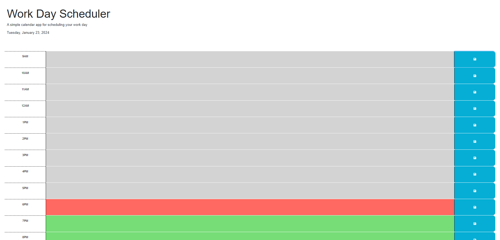

# Work-Day-Scheduler
The website is a "Work Day Scheduler" that provides a simple and user-friendly interface for users to plan and organize their workday. Here's a brief explanation of the website's functionality:

Title: Work Day Scheduler

Header:

The website features a header with a large title, "Work Day Scheduler," indicating its purpose.
Below the title, there's a brief description stating that it's a "simple calendar app for scheduling your work day."
The current date is displayed in the header.
Time Blocks:

The main content of the website consists of time blocks representing hours of the workday from 12 AM (midnight) to 9 PM.
Each time block includes the hour (e.g., "9AM," "10AM") on the left side.
In the middle of each time block, there's a textarea element where users can enter and save their tasks, appointments, or notes for a specific hour.
On the right side of each time block, there's a save button represented by a floppy disk icon. Users can click this button to save their input for that hour.
Styling:

The time blocks are visually styled to provide context based on the current time:
If the time block represents the current hour, it's styled as "present" (red background).
If the time block represents a past hour, it's styled as "past" (gray background).
If the time block represents a future hour, it's styled as "future" (green background).
Functionality:

Users can interact with the website by entering their tasks or notes into the textareas of the time blocks.
Clicking the save button in a time block stores the user's input for that specific hour using the browser's local storage.
The website automatically retrieves and displays previously saved user input when the page is refreshed or reopened, ensuring that users can see their planned tasks.
The current date is dynamically displayed in the header, keeping users informed about the current date as they plan their workday.
Overall, the Work Day Scheduler website is a practical tool for individuals to organize their workday, schedule tasks, and keep track of their daily activities within the context of the work hours from 12 AM to 9 PM.

https://youthfulmaster.github.io/Work-Day-Scheduler/